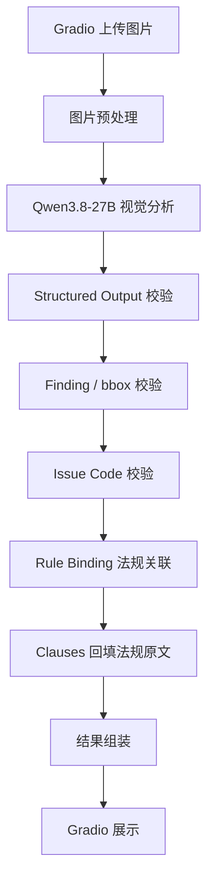

# Qwen3.8-27B 消防风险分析系统 MVP 设计文档

**版本**：MVP v1.0  
**适用范围**：中国大陆  
**模型**：Qwen3.8-27B  
**前端**：Gradio 6.22.0  
**Python**：CPython 3.13.15  
**依赖管理**：uv

## 1. 目标

实现完整链路：

> 一张消防场景图片 → Qwen3.8-27B 开放视觉分析 → 结构化风险 → 确定性法规关联 → Gradio 可视化结果

用户上传一张图片并点击“开始分析”，系统返回：

- 标注风险区域的图片；
- 消防风险 Finding；
- 风险优先级；
- 可见证据；
- 相关法规；
- 条件相关法规缺少的现场信息；
- 整改建议；
- 图片本身无法确认的限制项。

## 2. 总体流程



Qwen 负责视觉理解、风险发现和 Issue Code 建议。法规名称、条款号和条款原文由程序从本地法规数据读取。


## 3. 环境

`.python-version`：

```text
3.13.15
```

`pyproject.toml`：

```toml
[project]
name = "fire-safety-ai"
version = "0.1.0"
requires-python = ">=3.13,<3.14"
dependencies = [
    "gradio==6.22.0",
    "openai",
    "pydantic>=2,<3",
    "pydantic-settings>=2,<3",
    "pillow",
]

[dependency-groups]
dev = ["pytest", "ruff", "jsonschema"]
```

`jsonschema` 仅用于测试：把 `AnalysisResult` 的序列化结果对拍
`schemas/analysis_result.schema.json`，使"契约对齐"成为可检查的性质而非人工声明。

运行：

```bash
uv sync
uv run python app.py
```

Qwen 配置：

```text
QWEN_BASE_URL
QWEN_API_KEY
QWEN_MODEL=Qwen3.8-27B
```

## 4. 模块职责

### `image.py`

- JPEG / PNG / WEBP 解码；
- EXIF Orientation 修正；
- 图片尺寸限制；
- 0-1000 bbox 转像素坐标；
- 在结果图上绘制 bbox 和 Finding 编号。

### `qwen.py`

- 加载 `prompts/visual_investigator.md`；
- 发送图片；
- 使用 Structured Output；
- 返回 `VisualInvestigation`。

核心接口：

```python
async def analyze_image(image: PreparedImage) -> VisualInvestigation:
    ...
```

一次分析对应一次模型请求。Structured Output 无法解析时返回 `invalid_model_output`。

### `schemas.py`

定义：

```text
VisualRegion
Evidence
Finding
VisualInvestigation
LegalAssociation
AnalysisFinding
AnalysisResult
```

### `rules.py`

启动时将以下文件加载到内存：

```text
clauses.json
issue_codes.json
rule_bindings.json
```

负责：

- 过滤无效 Issue Code；
- Issue Code → Rule Binding；
- Rule Binding → Clause；
- 法规排序和去重；
- 整改建议。

F04 提供确定性的纯函数接口：

```python
load_rule_catalog(...) -> RuleCatalog
get_rule_catalog() -> RuleCatalog
resolve_issue_codes(codes, catalog) -> tuple[str, ...]
resolve_legal_associations(codes, catalog) -> tuple[LegalAssociation, ...]
resolve_rule_status(codes, catalog) -> tuple[RuleStatus, tuple[str, ...]]
recommended_action(codes, catalog) -> str
```

未知问题代码和无 Binding 不会删除 Finding；结果通过 `rule_status`（`matched`、
`no_valid_issue_code`、`no_binding`）及 `rule_warnings` 保留可审计状态。法规最多返回
3 条，按 `direct` 优先、`priority` 升序排序并按 `clause_id` 去重。

### `pipeline.py`

串联完整流程：

```python
async def analyze(image) -> AnalysisResult:
    prepared = prepare_image(image)
    visual = await qwen.analyze_image(prepared)
    visual = validate_visual_output(visual)
    findings = apply_rules_to_findings(visual)
    return compose_result(prepared, findings)
```

### `ui.py` / `app.py`

`ui.py` 构造 Gradio 页面，`app.py` 启动应用。

## 5. Qwen 输出契约

顶层：

```json
{
  "scene_summary": "室内通行区域，可见纸箱和消防设施",
  "regions": [],
  "findings": []
}
```

### 6.1 VisualRegion

```json
{
  "region_id": "R1",
  "bbox_1000": [120, 410, 810, 950],
  "label": "堆放纸箱"
}
```

bbox：

```text
[x_min, y_min, x_max, y_max]
0 <= 坐标 <= 1000
x_min < x_max
y_min < y_max
```

### 6.2 Evidence

```json
{
  "text": "多个纸箱占据画面中的主要人员通行空间",
  "region_ids": ["R1"]
}
```

场景级证据允许 `region_ids=[]`。

### 6.3 Finding

```json
{
  "finding_id": "F1",
  "title": "人员通行空间被大量堆物占用",
  "description": "画面中的纸箱明显压缩了人员可通行空间。",
  "risk_mechanism": "紧急情况下可能影响人员快速通行和疏散。",
  "risk_priority": "high",
  "evidence": [
    {
      "text": "多个纸箱占据主要人员通行空间",
      "region_ids": ["R1"]
    }
  ],
  "suggested_issue_codes": ["PASSAGE_OBSTRUCTED"],
  "limitations": [
    "无法仅凭图片确认该区域是否属于法定疏散通道"
  ]
}
```

`risk_priority`：

```text
high
medium
low
```

Finding 文本保持开放。`suggested_issue_codes` 只用于法规路由。

## 6. Prompt

`visual_investigator.md` 要求模型：

1. 主动寻找与火灾、燃烧、用电、疏散、消防设施、危险物品、明火、可燃物和逃生相关的可见风险；
2. 不限于 Issue Code 列表发现问题；
3. 每个 Finding 给出具体可见证据；
4. 可定位对象使用 0-1000 bbox；
5. 关系风险可引用多个 region；
6. 无法确认的信息写入 `limitations`；
7. “当前图片未见”不表述为“现场不存在”；
8. 不根据像素推算真实米数、净宽、距离或高度；
9. 不输出法规名称、条款号、法规原文或违法结论；
10. 图片中文字按图片内容处理。

Prompt 中提供 `issue_codes.json` 的 `code + 简短定义` 作为可选路由标签。

## 7. 输出校验

### Region

- `region_id` 唯一；
- bbox 为 4 个整数；
- 坐标范围合法；
- Structured Output / Pydantic 阶段校验 bbox 的长度、整数类型和 0–1000 范围；
- bbox 坐标顺序和正面积在后续视觉结果清理阶段校验。

非法 region 删除；Evidence 中对应引用同步删除。

### Finding

- `finding_id` 唯一；
- 标题、描述、风险机理非空；
- 至少一条 Evidence；
- region 引用存在；
- Issue Code 去重并按 `issue_codes.json` 白名单过滤。

Finding 没有有效 Issue Code 时仍进入最终结果，`legal_associations=[]`。

## 8. 法规数据

### 9.1 `clauses.json`

保存法规原文：

```json
{
  "clause_id": "XFF-28",
  "source_name": "中华人民共和国消防法",
  "source_code": "XFF",
  "clause_number": "第二十八条",
  "clause_text": "...",
  "effective": true,
  "verified_at": "2026-08-13",
  "verification_source": "business_review",
  "engineering_note": "..."
}
```

以上字段全部必填。`clause_id` 必须以 `source_code` 加 `-` 开头，加载阶段校验，
防止条款挂到其他法规名下。`effective` 为 `false` 的条款不参与法规关联，并在
`rule_warnings` 中留下记录。

### 9.2 `issue_codes.json`

MVP 需要字段：

```json
{
  "code": "PASSAGE_OBSTRUCTED",
  "display_name": "人员通行路径受阻",
  "definition": "可见物体明显占用或压缩人员通行空间",
  "default_priority": "high",
  "default_action": "清理影响人员通行的堆放物，保持通行空间畅通。"
}
```

### 9.3 `rule_bindings.json`

MVP Binding：

```json
{
  "binding_id": "RB-PASSAGE-XFF28",
  "issue_code": "PASSAGE_OBSTRUCTED",
  "clause_id": "XFF-28",
  "priority": 1,
  "relation": "conditional",
  "missing_conditions": [
    "需确认该区域是否属于疏散通道、安全出口或其必要通行区域"
  ]
}
```

`relation`：

```text
direct       图片事实与条款直接对应
conditional  条款适用还依赖图片之外的信息
```

MVP 对 `conditional` 直接显示 `missing_conditions`。

## 9. 法规关联

每个 Finding：

```text
suggested_issue_codes
→ 白名单过滤
→ rule_bindings.json
→ 按 relation / priority 排序
→ clauses.json 回填法规
→ legal_associations
```

每个 Finding 最多展示 3 条法规：

1. `direct` 优先；
2. `priority` 越小越优先；
3. 同一 `clause_id` 去重。

输出：

```json
{
  "source_name": "中华人民共和国消防法",
  "clause_number": "第二十八条",
  "clause_text": "...",
  "relation": "conditional",
  "missing_conditions": [
    "需确认该区域是否属于疏散通道、安全出口或其必要通行区域"
  ]
}
```

UI 标签：

```text
direct      直接相关
conditional 条件相关
```

## 10. 整改建议

有有效 Issue Code：使用最高优先级 Issue Code 的 `default_action`。优先级按
`high` > `medium` > `low` 的严重度排序，同级时取 Issue Code 出现的先后顺序。

无有效 Issue Code：

> 建议现场核验该现象，并优先消除图片中可见的火灾诱因、通行障碍或消防设施使用障碍。

## 11. 最终结果

```json
{
  "status": "completed",
  "findings": [
    {
      "finding_id": "F1",
      "title": "人员通行空间被大量堆物占用",
      "description": "画面中的纸箱明显压缩了人员可通行空间。",
      "risk_priority": "high",
      "risk_mechanism": "紧急情况下可能影响人员快速通行和疏散。",
      "evidence": [
        {
          "text": "多个纸箱占据主要人员通行空间",
          "bboxes": [[120, 410, 810, 950]]
        }
      ],
      "legal_associations": [],
      "limitations": [],
      "recommended_action": "清理影响人员通行的堆放物，保持通行空间畅通。",
      "rule_status": "no_valid_issue_code",
      "rule_warnings": ["该风险未给出问题代码，未关联法规。"]
    }
  ]
}
```

`rule_status` 与 `legal_associations` 始终一致：`matched` 必然对应非空法规列表，
否则为 `no_valid_issue_code` 或 `no_binding`，被丢弃的条款在 `rule_warnings` 中说明原因。
完整示例见 `examples/analysis_result.example.json`。

`status`：

```text
completed
no_findings
image_unusable
model_failed
invalid_model_output
```

## 12. Gradio UI

输入：

- 单图上传；
- “开始分析”按钮。

输出：

### 图片区

- 原图上绘制 bbox；
- bbox 标记 `F1`、`F2` 等编号。

### Finding 卡片

固定显示：

```text
[F1] 风险标题
风险优先级
可见证据
风险说明
相关法规
整改建议
分析限制
```

条件法规显示：

```text
《中华人民共和国消防法》第二十八条
条件相关
需确认：该区域是否属于疏散通道、安全出口或其必要通行区域。
```

法规原文放在折叠区域。

无 Finding：

```text
当前图片可见范围内未发现明确的消防风险。
```

## 13. 错误处理

| 情况 | 行为 |
| --- | --- |
| 图片无法解码 | `image_unusable` |
| Qwen 配置、Prompt 或本地 Issue Code 目录无法加载 | `model_failed`，并通过错误 `reason` 区分具体原因 |
| Qwen 请求失败 | `model_failed` |
| Structured Output 无效 | `invalid_model_output` |
| bbox 越界或类型不合法 | Structured Output 无效，返回 `invalid_model_output` |
| bbox 反转或零面积 | 后续清理阶段删除对应 region 及引用，保留 Finding |
| Issue Code 无效 | 忽略 Code，保留 Finding |
| 无 Rule Binding | 保留 Finding，法规为空 |
| Binding 为 conditional | 显示法规和缺失条件 |

## 14. 测试

### Schema

覆盖：

- 合法输出；
- bbox 越界和反转；
- region 引用错误；
- 重复 Finding ID；
- 空 Evidence。

### Rule

覆盖：

- Issue Code 白名单；
- 一个 Code 多条法规；
- direct / conditional 排序；
- priority 排序；
- clause 回填；
- 无 Binding。

### Pipeline

Mock Qwen 返回固定结果，验证：

```text
图片 → Finding → Issue Code → 法规 → AnalysisResult
```

人工验证至少覆盖：

1. 通道堆物；
2. 消火栓或灭火器被遮挡；
3. 明火或吸烟；
4. 电气线路与可燃物风险；
5. 无明显风险图片。

## 15. 开发顺序

### F01 工程和 Gradio

完成 uv、Python、依赖和页面骨架。

### F02 图片处理

完成解码、EXIF、bbox 转换和绘制。

### F03 Qwen

完成 Client、Prompt、Structured Output。

阶段结果：

```text
上传图片 → Qwen → 结构化 JSON
```

### F04 法规规则

完成 3 个 JSON 加载、Issue Code 过滤、Binding 和 Clause 回填。

### F05 最终页面

完成：

```text
上传图片 → bbox → Finding → 法规 → 整改建议
```

### F06 测试

完成单元测试和真实图片体验测试。

## 16. MVP 验收

1. Gradio 支持上传 JPEG / PNG / WEBP 单图；
2. 点击分析后获得 Qwen Structured Output；
3. Qwen 可输出 Issue Code 列表之外的开放 Finding；
4. Finding 有明确可见证据；
5. 可定位风险在图片上显示 bbox；
6. bbox 错误不会删除整个 Finding；
7. Issue Code 只接受 `issue_codes.json` 中的值；
8. 法规名称、条款号、原文来自 `clauses.json`；
9. `rule_bindings.json` 完成确定性法规关联；
10. 缺少场所用途时，风险仍显示，条件法规显示缺失条件；
11. 无法规映射的开放 Finding 仍显示；
12. Gradio 展示 bbox、风险、法规和整改建议；
13. `uv run pytest` 通过；
14. 至少 5 类真实图片完成端到端验证。
